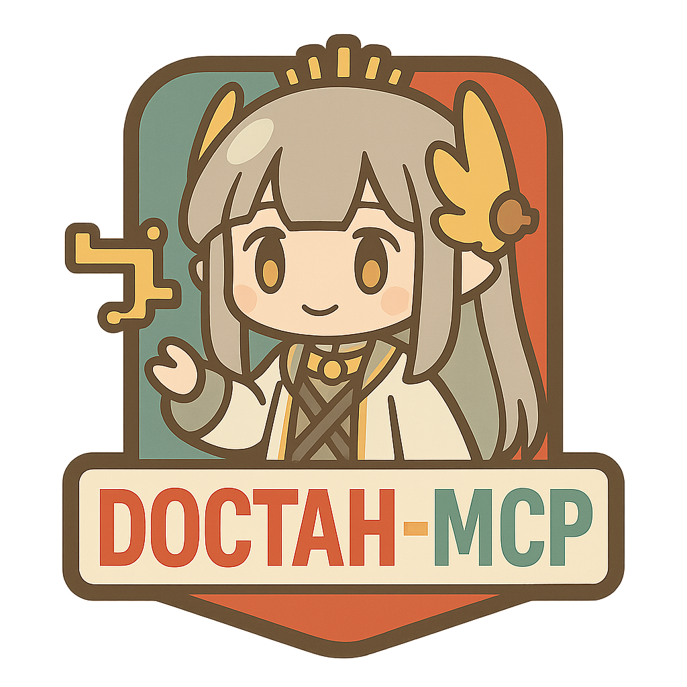

<div align="center">



# Doctah-MCP

[](https://opensource.org/licenses/MIT)
[](https://www.python.org/downloads/)
[](https://modelcontextprotocol.io/)

**🌍 Language / 语言选择:**
[🇺🇸 English](README.md) | [🇨🇳 中文](README_zh.md)

</div>

> 🎯 Enable AI assistants to search and access Arknights game data through a simple MCP interface.

The Doctah-MCP Server provides a bridge between AI assistants and PRTS.wiki's Arknights repository through the Model Context Protocol (MCP). It allows AI models to search for operators and enemies and access their content in a programmatic way.

## ✨ Core Features

* 🎯 **Operator Search**: Query detailed operator information including skills, talents, and attributes
* ⚔️ **Enemy Intelligence**: Access comprehensive enemy data with level progression
* 📋 **List Search**: Find operators and enemies with fuzzy search functionality
* 🔍 **Content Verification**: Smart content validation to distinguish operators from enemies
* 🤖 **AI-Friendly**: Clean Markdown output with consistent structure

## 🚀 Quick Start

### Install from Source

```bash
git clone https://github.com/TonybotNi/Doctah-MCP.git
cd doctah-mcp
pip install -e .
```

**Verify installation:**
```bash
# Test if global command works
doctah-mcp --help

# Or test with Python module
python -m doctah_mcp.server --help
```

For development:

```bash
# Clone and set up development environment
git clone https://github.com/TonybotNi/Doctah-MCP.git
cd doctah-mcp

# Install with test dependencies
pip install -e ".[dev]"
```

### 🔌 MCP Integration

Choose one of the following configuration methods for your MCP client config file:

**Method 1: Using global command (recommended)**
```json
{
    "mcpServers": {
        "doctah-mcp": {
            "command": "doctah-mcp",
            // Or use full path: "/full/path/to/doctah-mcp"
            "args": []
        }
    }
}
```
> 💡 If `doctah-mcp` command is not found, use Method 3 with full path to python executable

**Method 2: Using Python module**
```json
{
    "mcpServers": {
        "doctah-mcp": {
            "command": "python",
            "args": ["-m", "doctah_mcp.server"]
        }
    }
}
```

**Method 3: Using full path (most reliable)**
```json
{
    "mcpServers": {
        "doctah-mcp": {
            "command": "/full/path/to/python",
            "args": ["-m", "doctah_mcp.server"],
            "cwd": "/path/to/doctah-mcp-folder"
        }
    }
}
```

> 💡 **Note**: `cwd` is the working directory, only needed in method 3, pointing to your downloaded doctah-mcp project folder

## 💡 Available Tools

The server provides four main tools:

### 1. Operator Search

Search for detailed operator information:

```python
result = await call_tool("search_operator_mcp", {
    "name": "Amiya",
    "sections": "skills,talents"
})
```

### 2. Enemy Search

Get comprehensive enemy data:

```python
result = await call_tool("search_enemy_mcp", {
    "name": "Originium Slug",
    "sections": "level0,level1"
})
```

### 3. List Operators

Find operators matching a pattern:

```python
result = await call_tool("list_operators_mcp", {
    "name": "guard"
})
```

### 4. List Enemies

Find enemies matching a pattern:

```python
result = await call_tool("list_enemies_mcp", {
    "name": "drone"
})
```

## 📁 Client Configuration

### Claude Desktop

Configuration file locations:
- **macOS**: `~/Library/Application Support/Claude/claude_desktop_config.json`
- **Windows**: `%APPDATA%\Claude\claude_desktop_config.json`
- **Linux**: `~/.config/Claude/claude_desktop_config.json`

**Recommended configuration (simplest):**
```json
{
  "mcpServers": {
    "doctah-mcp": {
      "command": "doctah-mcp",
      "args": []
    }
  }
}
```

**Fallback configuration (if above doesn't work):**
```json
{
  "mcpServers": {
    "doctah-mcp": {
      "command": "/full/path/to/python",
      "args": ["-m", "doctah_mcp.server"],
      "cwd": "/path/to/doctah-mcp-folder"
    }
  }
}
```

### Cherry Studio

1. Open Cherry Studio → Settings → MCP Servers → Add
2. Select Type: STDIO
3. **Simple configuration**:
   - **Command**: `doctah-mcp`
   - **Args**: `[]`
4. **Fallback configuration** (if above doesn't work):
   - **Command**: `/full/path/to/python`
   - **Args**: `["-m", "doctah_mcp.server"]`
   - **Cwd**: `/path/to/doctah-mcp-folder`

## ⚙️ Configuration

Configure through environment variables:

| Variable | Purpose | Default |
|----------|---------|---------|
| LOG_LEVEL | Logging level | INFO |

## 🧪 Testing

Run the test suite:

```bash
python -m pytest
```

## 📄 License

Released under the MIT License. See the [LICENSE](LICENSE) file for details.

## 📖 Detailed Setup Guides

Need more detailed configuration and troubleshooting? Check out:
- [Claude Desktop Detailed Setup](docs/setup/claude_desktop.md)
- [Cherry Studio Detailed Setup](docs/setup/cherry_studio.md)

---

<div align="center">

Made with ❤️ for Arknights community

## GitHub Star History

[](https://star-history.com/#tonybotni/doctah-mcp&Date)

</div> 